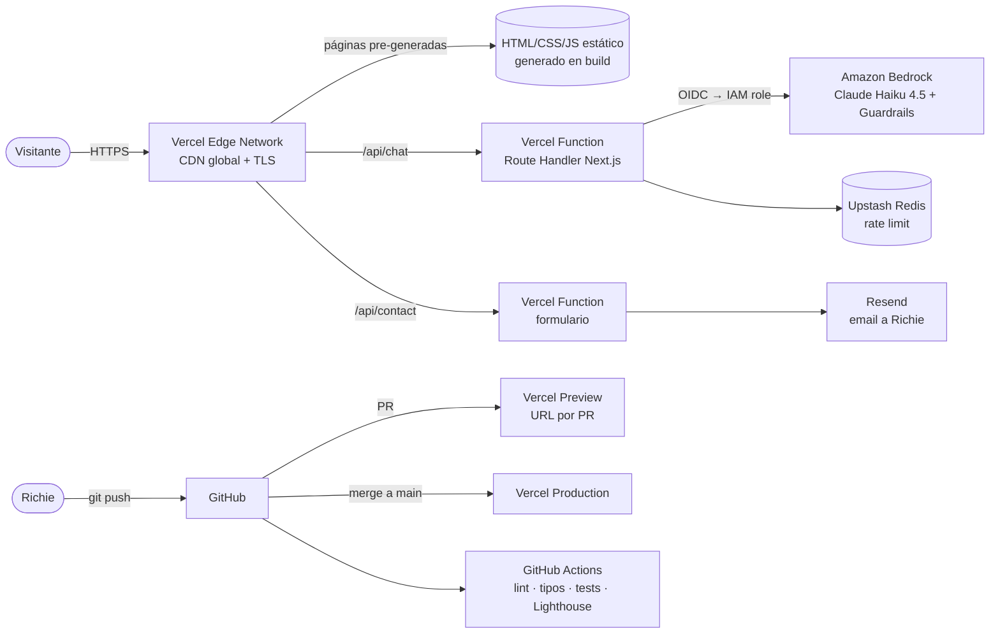
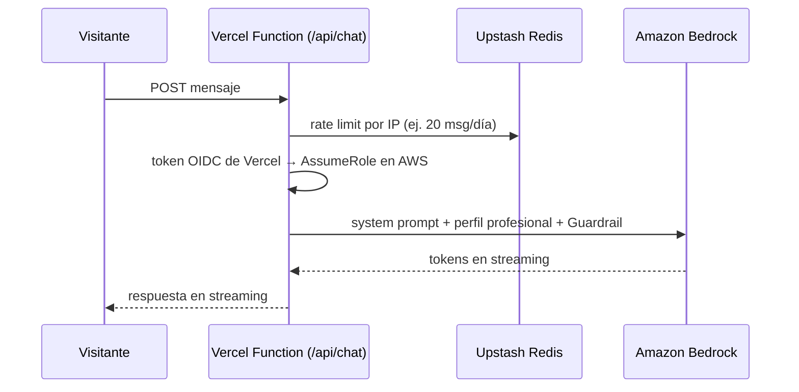

# Arquitectura — Web personal de Ricardo Gómez ("Richie")

> **Estado:** Propuesta v0.2 · **Fecha:** 2026-10-02 · **Owner:** Ricardo Andrés Gómez Torres
> **Repo:** `RicardoAGomezT/web-portfolio`
> **Decisiones base (tomadas por Richie):** objetivo combinado (empleo + freelance) · **Next.js + Tailwind** · hosting en **Vercel (gratis)**

---

## 1. Propósito

| # | Objetivo | Métrica de éxito |
|---|----------|------------------|
| 1 | **Búsqueda de empleo**: que un recruiter entienda en <30 s que Richie es *AI Engineer / AI DevOps / Data Engineer* y lo contacte | Clics en "Contacto", descargas de CV, tráfico desde LinkedIn/GoB/Torre |
| 2 | **Freelance / consultoría** (EUDR cacao, AIOps, automatización) | Solicitudes de contacto con intención de proyecto |
| 3 | **La web demuestra lo que sabe hacer**: un asistente IA en vivo, CI/CD y buen rendimiento | Repo legible, Lighthouse ≥ 95, chat IA funcionando |

### Audiencias

| Audiencia | Idioma | Qué busca | Dónde aterriza |
|-----------|--------|-----------|----------------|
| Recruiters LATAM (GoB, Torre, WeRemoto) | ES | Rol, stack, certificaciones, disponibilidad remota | Home → CV |
| Recruiters / clientes globales (Malt, remoto global) | EN | Lo mismo, en inglés | `/en` |
| Tech leads / entrevistadores | ES/EN | Profundidad técnica, casos reales, código | Proyectos, blog, GitHub |
| Clientes freelance | ES | Problema que resuelve, credibilidad | Servicios / proyectos |

---

## 2. Principios

1. **Estático donde se pueda, dinámico donde haga falta.** Las páginas de contenido se generan en build; solo el asistente IA y el formulario de contacto ejecutan código en el servidor.
2. **Costo cero en fase 1.** Vercel Hobby + dominio propio opcional.
3. **Bilingüe desde el inicio.** ES por defecto, EN completo.
4. **Contenido como código.** MDX en el repo; sin CMS ni base de datos.
5. **Seguridad por defecto.** Secretos solo en variables de entorno de Vercel; sin llaves de AWS de larga duración (OIDC).
6. **Privacidad.** Solo información profesional (ver §9).

---

## 3. Vista general



---

## 4. Frontend

| Decisión | Elección | Por qué |
|----------|----------|---------|
| Framework | **Next.js 15+ (App Router)** + TypeScript | Decisión de Richie. Estándar de la industria, mucha demanda laboral, encaja perfecto con Vercel |
| Renderizado | **SSG** (Static Site Generation) para todas las páginas de contenido · funciones del servidor solo en `/api/*` | Las páginas cargan como archivos estáticos desde el CDN: rápidas y gratis |
| Estilos | **Tailwind CSS 4** | Decisión de Richie |
| Componentes UI | **shadcn/ui** (opcional) | Componentes accesibles que se copian al repo, no son una dependencia cerrada |
| Contenido | **MDX + esquemas Zod** (con Velite o Content Collections) | Experiencia, proyectos, certificaciones y posts tipados y validados en build |
| i18n | **next-intl** con rutas `/es` (por defecto) y `/en` | La librería de i18n más usada con App Router; genera `hreflang` |
| Imágenes | `next/image` | AVIF/WebP y tamaños responsive automáticos |
| SEO | Metadata API de Next, `sitemap.ts`, `robots.ts`, imágenes Open Graph, JSON-LD `Person` | Mejor aparición en Google y en previews de LinkedIn |
| Tema | Claro/oscuro (`next-themes`) | Estándar esperado en perfiles tech |
| Chat IA (UI) | **Vercel AI SDK** (`useChat`) | Streaming de respuestas token a token con poco código |

### Mapa del sitio

```
/[locale]                       Home: headline, propuesta de valor, stack, CTA (CV + contacto)
/[locale]/sobre-mi              Trayectoria Big Data → DataOps → AIOps
/[locale]/experiencia           Timeline de roles
/[locale]/proyectos             Casos: EUDR cacao, AIOps, esta web
/[locale]/proyectos/[slug]      Caso detallado: problema → arquitectura → resultado
/[locale]/certificaciones       AWS (SAA, Developer, AI Practitioner) + Azure (AI-900, DP-900, AZ-900)
/[locale]/servicios             Oferta freelance / consultoría
/[locale]/blog                  Artículos técnicos (fase 3)
/[locale]/blog/[slug]
/[locale]/contacto              Formulario + LinkedIn, GitHub, email
/cv/richie-gomez-cv-{es,en}.pdf Descarga directa
/api/chat                       Asistente IA (fase 2)
/api/contact                    Envío del formulario
```

---

## 5. Hosting y despliegue (Vercel)

| Componente | Servicio | Detalle |
|------------|----------|---------|
| Hosting + CDN | **Vercel Hobby** (gratis) | Despliegue automático conectado a GitHub, HTTPS automático, CDN global |
| Previews | **Preview Deployments** | Cada PR genera una URL propia para revisar antes de publicar |
| Dominio | `web-portfolio-*.vercel.app` gratis · dominio propio opcional (~USD 12–15/año) | Se conecta en Vercel con un registro DNS |
| Funciones | **Vercel Functions** (Node.js) | Ejecutan `/api/chat` y `/api/contact` solo cuando alguien las llama |
| Variables de entorno | Vercel Project Settings | Separadas por entorno: Production / Preview / Development |
| Analítica | **Vercel Web Analytics** + **Speed Insights** | Sin cookies; incluidas en el plan gratis (con límites) |

> ⚠️ El plan **Hobby es para uso personal y no comercial**. Un portafolio personal está bien. Si la web empieza a vender servicios directamente (pagos, landing comercial), hay que pasar a **Pro (USD 20/mes)** o migrar a AWS (ver §10).

### Flujo de trabajo

1. Crear una rama → hacer cambios → abrir un PR.
2. GitHub Actions corre las validaciones y Vercel publica una **preview URL**.
3. Merge a `main` → Vercel despliega a producción automáticamente.

### CI (GitHub Actions)

| Workflow | Disparador | Pasos |
|----------|-----------|-------|
| `ci.yml` | Pull request | `npm ci` → `tsc --noEmit` → ESLint → tests (Vitest) → `next build` |
| `lighthouse.yml` | Preview desplegada | Lighthouse CI contra la preview URL (umbral ≥ 95) |

Controles: branch protection en `main` (CI verde obligatorio) y Dependabot o Renovate para dependencias.

---

## 6. Fase 2 — Asistente IA "Pregúntale a Richie"

Un chat en la web que responde sobre la experiencia profesional de Richie. Demuestra en vivo Bedrock, guardrails y streaming, que es justo su perfil.



| Decisión | Elección | Por qué |
|----------|----------|---------|
| Endpoint | Route Handler `app/api/chat/route.ts` | Vive en el mismo repo y se despliega con la web |
| SDK | **Vercel AI SDK** + provider `@ai-sdk/amazon-bedrock` | Streaming listo; cambiar de modelo o proveedor es una línea |
| Modelo | **Claude Haiku 4.5** en Bedrock | Bajo costo y latencia; suficiente para preguntas sobre un CV. Usar Bedrock en vez de la API directa muestra experiencia con AWS |
| Credenciales AWS | **Vercel OIDC Federation** → IAM role con permiso solo para `bedrock:InvokeModel*` sobre ese modelo | Sin access keys guardadas |
| Conocimiento | **Context stuffing + prompt caching**: el perfil profesional (~5–10 K tokens) va en el system prompt | Con tan poco contenido, un RAG con base vectorial sobra. Migrar a Bedrock Knowledge Bases solo si se suma el blog |
| Seguridad | **Bedrock Guardrails** (temas denegados, PII, prompt injection) + `maxTokens` de salida | Evita abuso y fugas de información |
| Anti-abuso | **Upstash Redis** (`@upstash/ratelimit`), gratis vía Vercel Marketplace | Rate limit por IP sin montar infraestructura |
| Costo | AWS Budget con alarma a USD 5 · métrica de tokens/día | Tope de gasto controlado |
| Infra AWS | **Terraform** mínimo en `infra/`: IAM role OIDC, Guardrail y Budget | Lo poco que vive en AWS también queda como código |

> Fuente del conocimiento: `content/assistant/profile.{es,en}.md`, una versión **solo profesional** del perfil (ver §9).

---

## 7. Formulario de contacto

| Pieza | Elección |
|-------|----------|
| Envío | Server Action o `/api/contact` → **Resend** (3 000 emails/mes gratis) |
| Validación | Zod en cliente y servidor |
| Anti-spam | Honeypot + rate limit (Upstash) + **Cloudflare Turnstile** si aparece spam |

---

## 8. Estructura del repositorio

```
web-portfolio/
├── src/
│   ├── app/
│   │   ├── [locale]/             # páginas ES/EN
│   │   │   ├── page.tsx          # home
│   │   │   ├── proyectos/
│   │   │   ├── blog/
│   │   │   └── ...
│   │   ├── api/
│   │   │   ├── chat/route.ts     # fase 2
│   │   │   └── contact/route.ts
│   │   ├── sitemap.ts
│   │   └── robots.ts
│   ├── components/
│   ├── i18n/                     # configuración next-intl
│   └── lib/
├── content/
│   ├── experience/{es,en}/*.mdx
│   ├── projects/{es,en}/*.mdx
│   ├── certifications/*.yaml
│   ├── posts/{es,en}/*.mdx
│   └── assistant/profile.{es,en}.md
├── messages/{es,en}.json         # textos de la interfaz
├── public/cv/
├── infra/terraform/              # solo AWS: IAM OIDC, Guardrail, Budget (fase 2)
├── .github/workflows/
├── docs/
│   ├── ARCHITECTURE.md
│   └── adr/
├── CLAUDE.md
└── README.md
```

---

## 9. Privacidad: qué se publica y qué no

| ✅ Publicar | ❌ No publicar |
|------------|---------------|
| Nombre, headline, región ("Bucaramanga, Colombia") | Dirección o sector exacto |
| Stack, certificaciones, trayectoria | Finanzas, hipoteca, obligaciones |
| Proyectos profesionales (EUDR, AIOps) | Salud, lesiones, resultados médicos |
| Intereses generales (opcional: motos, tecnología) | Familia y datos de terceros |
| Disponibilidad para remoto / freelance (ver nota) | Salario esperado, ofertas específicas en evaluación |

> ⚠️ **Empleador actual:** un mensaje de "abierto a oportunidades" lo puede ver ADL/Grupo Aval. Opciones: (a) neutro, *"Disponible para proyectos y colaboraciones"*, o (b) explícito. Para freelance paralelo, revisar antes la cláusula de exclusividad.

---

## 10. Alternativa considerada: AWS (S3 + CloudFront)

| Criterio | Vercel (elegido) | AWS S3 + CloudFront |
|----------|------------------|---------------------|
| Tiempo para publicar | Minutos | Horas (Terraform, certificados, DNS, pipeline) |
| Costo | USD 0 | ~USD 1–2/mes |
| Next.js con funciones del servidor | Nativo | S3 solo sirve archivos estáticos: necesita `output: 'export'` (sin funciones) o algo como OpenNext/Amplify |
| Previews por PR | Automáticas | Hay que construirlas |
| Vitrina de skills AWS/IaC | Media (Bedrock + Terraform del IAM) | Alta |

**Decisión:** Vercel para salir rápido y gratis. Los skills de AWS se muestran con el asistente (Bedrock, OIDC, Guardrails, Terraform). Si más adelante se quiere, migrar a AWS es un proyecto de portafolio en sí mismo: *"cómo migré mi web de Vercel a AWS con Terraform"*.

---

## 11. Roadmap

| Fase | Alcance | Entregable |
|------|---------|-----------|
| **0 · Fundaciones** | Scaffold de Next.js + Tailwind + next-intl, conectar Vercel, CI | Web "hola mundo" en `*.vercel.app` con deploy automático |
| **1 · MVP** | Home, sobre mí, experiencia, proyectos (3 casos), certificaciones, servicios, contacto, CV, ES/EN, SEO | Web publicada y enlazada desde LinkedIn/GoB/Torre |
| **2 · Asistente IA** | `/api/chat` + Bedrock + Guardrails + rate limit + widget de chat | "Pregúntale a Richie" en producción |
| **3 · Autoridad** | Blog técnico (AIOps, MCP, agentes), dominio propio, caso de estudio "cómo construí esta web" | Contenido que posiciona en búsquedas y entrevistas |

---

## 12. Decisiones

| # | Decisión | Estado |
|---|----------|--------|
| D1 | Nombre del repo | ✅ `web-portfolio` |
| D2 | Framework | ✅ Next.js + Tailwind |
| D3 | Hosting | ✅ Vercel Hobby |
| D4 | Visibilidad del repo | ⏳ Recomendado: **público** (el código también es portafolio) |
| D5 | Dominio propio | ⏳ Opcional en fase 1. Ej.: `ricardogomez.dev` (verificar disponibilidad) |
| D6 | Mensaje de disponibilidad | ⏳ Ver §9 |
| D7 | Identidad visual | ⏳ Definir en fase 1 |

---

## 13. ADRs iniciales (a crear en `docs/adr/`)

1. `0001-nextjs-app-router.md`: Next.js con SSG + Route Handlers.
2. `0002-vercel-hosting.md`: Vercel sobre AWS para la fase 1 (ver §10).
3. `0003-bedrock-via-vercel-oidc.md`: acceso a Bedrock sin credenciales estáticas.
4. `0004-context-stuffing-over-rag.md`: no usar base vectorial mientras el corpus sea menor a ~50 K tokens.
5. `0005-bilingual-content.md`: estructura de contenido ES/EN con next-intl + MDX.
